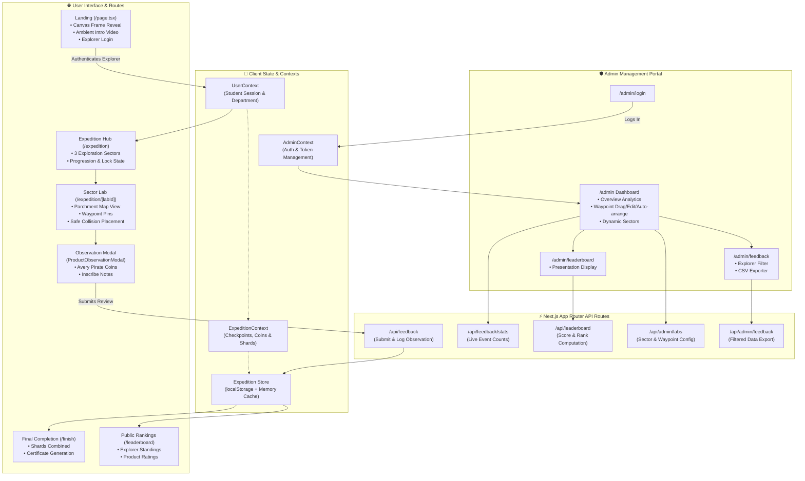

# 🏴‍☠️ TechX Expedition — Interactive Feedback & Discovery Portal

A gamified, cinematic, full-stack feedback and evaluation web application built with **Next.js 16 (App Router)**, **Turbopack**, **Tailwind CSS v4**, **Framer Motion**, and **Canvas Animations**.

Inspired by pirate and uncharted expeditions (*"Sic Parvis Magna"*), students and attendees navigate through multiple sectors, discover showcased projects, rate them using interactive Avery Pirate Coins, unlock certificate fragments, and complete their expedition journal.

---

## 🗺️ Architecture & Flow Overview

```
[ Landing Page ] (Canvas Video Reveal + Explorer Registration)
       │
       ▼
 [ Route Selection / Sectors Map ] (/expedition)
       │
       ├─► Sector 01 (Portolan Charts) ──► Product Observation Dossier (Avery Coins + Notes)
       ├─► Sector 02 (Golden Compass)  ──► Product Observation Dossier (Avery Coins + Notes)
       └─► Sector 03 (Treasure Island) ──► Product Observation Dossier (Avery Coins + Notes)
             │
             ▼
[ Journal & Certificate Shards ] (Fragment Unlocks + Stamp Animations)
       │
       ▼
 [ Final Expedition Certificate ] (/finish)
       │
       ▼
[ Public Leaderboard & Admin Suite ]
       ├─► /leaderboard (Live rankings with sound & video)
       ├─► /admin/login (Protected authentication)
       ├─► /admin (Live analytics, sector waypoints & product manager)
       ├─► /admin/leaderboard (Signboard presentation display)
       └─► /admin/feedback (Filterable ledger with CSV export)
```

---

## 📊 System Architecture Graph (Graphify ERD & Component Dependency)



---

## 💎 Gemstone & Coin Scoring System

Feedback evaluations are graded on a 5-tier system:

| Tier | Gemstone / Coin Rating | Token Name | Reward Weight |
| :---: | :--- | :--- | :---: |
| 🪙 1 | **Rough Stone / 1 Coin** | `ROUGH_STONE` | 1 pt |
| 🪙 2 | **Emerald / 2 Coins** | `EMERALD` | 2 pts |
| 🪙 3 | **Ruby / 3 Coins** | `RUBY` | 3 pts |
| 🪙 4 | **Sapphire / 4 Coins** | `SAPPHIRE` | 4 pts |
| 🪙 5 | **Diamond / 5 Coins** | `DIAMOND` | 5 pts |

---

## 🛠️ Tech Stack & Key Libraries

- **Framework**: [Next.js 16.3.1](https://nextjs.org/) (App Router + Turbopack)
- **Styling**: [Tailwind CSS v4](https://tailwindcss.com/)
- **Animations**: [Framer Motion](https://www.framer.com/motion/) + Canvas frame sequencer
- **UI Components**: Modern dark dashboard, custom SVG brass compasses, leather dossier cards
- **Data Persistence**: In-memory caching + `localStorage` with MongoDB / Prisma schema compatibility
- **Runtime**: Node.js 20+ / Bun

---

## 🚀 Getting Started

### 1. Installation

```bash
git clone https://github.com/VIHAR2212/feedback-techx.git
cd feedback-techx
npm install
```

### 2. Run the Development Server

```bash
npm run dev
```

Open [http://localhost:3000](http://localhost:3000) in your browser.

### 3. Build for Production

```bash
npm run build
npm run start
```

---

## 🔒 Admin Credentials

- **Path**: `/admin/login`
- **Default Username**: `vcet-nsdc`
- **Default Password**: `AIDS@2025`

*(Credentials can be configured via environment variables in `.env.local`)*

---

## 📜 License

Created for the TechX Departmental Event. All rights reserved.
