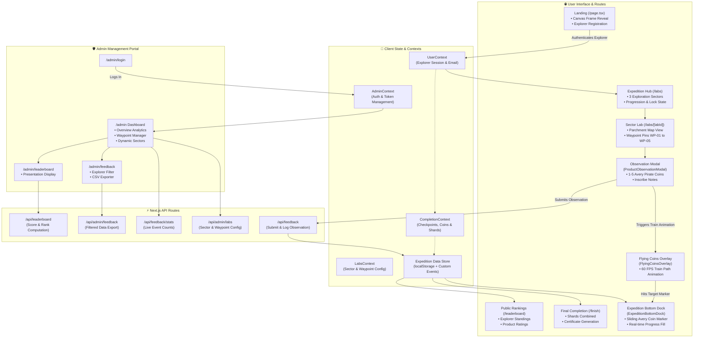

# 🏴‍☠️ TechX Expedition — Gamified Feedback & Exploration Platform

A cinematic, full-stack, gamified feedback and project evaluation web application built with **Next.js 16 (App Router)**, **Turbopack**, **Tailwind CSS v4**, **Framer Motion**, and **GPU-Accelerated Canvas Animations**.

Inspired by pirate lore and the *Uncharted* series (*"Sic Parvis Magna"*), attendees navigate through multiple research sectors, explore showcased tech projects, rate them using interactive Avery Pirate Coins, unlock certificate fragments, and complete their expedition journal.

---

## 🗺️ Expedition User Flow

```
[ Landing Page ] ──► (Canvas Video Intro & Explorer Registration)
        │
        ▼
 [ Route Selection ] (/labs) ──► (3 Primary Exploration Sectors)
        │
        ├─► Sector 01 (Portolan Charts) ──► Waypoints WP-01 to WP-05
        ├─► Sector 02 (Golden Compass)  ──► Waypoints WP-01 to WP-05
        └─► Sector 03 (Treasure Island) ──► Waypoints WP-01 to WP-05
              │
              ▼
[ Observation Dossier Modal ] ──► (1-5 Avery Pirate Coin Rating + Notes)
              │
              ▼
[ 60 FPS Flying Coin Train ] ──► (Arcade stream from chosen coin down to bottom gauge)
              │
              ▼
[ Persistent Expedition Bottom Dock ] ──► (Real-time X/15 logged + Sliding Avery Coin)
              │
              ▼
 [ Journal Certificate Shards ] ──► (Fragment Unlocks & Stamp Animations)
              │
              ▼
  [ Final Expedition Certificate ] (/finish) ──► (Downloadable High-Res Parchment Credential)
              │
              ▼
[ Public Leaderboard & Admin Suite ]
        ├─► /leaderboard (Live rankings with sound & visual flair)
        ├─► /admin/login (Protected administrative authentication)
        ├─► /admin (Live analytics, sector waypoints & product manager)
        ├─► /admin/leaderboard (Signboard presentation display)
        └─► /admin/feedback (Filterable ledger with CSV export)
```

---

## ✨ Key Features & Highlights

### 🪙 1. 60 FPS Clash of Clans Style Flying Coin Train Animation
- **Origin-Aware Burst**: Spawns an energetic train of Avery Pirate Coins directly from the exact rating coin clicked (e.g. 4th coin for rating 4, 3rd coin for rating 3).
- **Initial Elastic Shockwave Distortion**: Coins experience a spring expansion and mechanical charge before entering the trajectory.
- **Dense 11-Point Cubic Bezier Rail ("Train Path")**: All coins follow the exact same smooth mathematical trajectory in a single-file cascade.
- **Pure Transparent Circular Coins**: Crisp circular rendering with natural alpha drop shadows and zero square background artifacts.
- **Magnetic Gauge Impact**: Sparks burst upon arrival as the bottom gauge Avery Coin marker pulses and increments the progress fill.
- **Hardware-Accelerated**: 100% GPU compositor execution (`translate3d`, `scale`, `rotate`) ensuring 60–120 FPS performance on budget mobile devices.

### 🧭 2. Global Persistent Expedition Bottom Dock
- **Always Visible**: Docked across all explorer views (`/labs`, `/labs/[labId]`, `/leaderboard`, `/finish`, etc.), cleanly hidden on `/` and `/admin/*`.
- **Antique Recessed Brass Gauge**: Displays real-time `Overall Logged: X/15` and `% RATED`.
- **Sliding Avery Pirate Coin Marker**: Moves continuously along the brass track in real-time as feedback is logged.
- **Impact Reactions**: Responds dynamically with golden pulse shockwaves (`isImpacting`) when feedback is submitted.

### 📜 3. Interactive Parchment Journal & Map System
- **Antique Uncharted Aesthetics**: Aged parchment maps, leather bindings, Nathan Drake handwriting typography (*Caveat*), and glowing coordinate pins (`WP-01` to `WP-05`).
- **Mobile Responsive Book Layout**: Responsive height scaling (`100dvh`) with zero vertical clipping on mobile and tablet screens.
- **Review Dossier Modal**: Antique wax-sealed observation modal with 1–5 coin rating selector, telemetry impressions textarea, and gold-trimmed submission buttons.

### 🏆 4. Certificate Shards & Final Credential Generation
- **Shard Unlocks**: Earn sector relics and certificate fragments upon completing checkpoint evaluations.
- **Parchment Certificate**: Interactive final certificate with custom explorer details, departmental seal, and high-resolution export.

### 🛡️ 5. Real-Time Admin Portal & Analytics
- **Live Overview Dashboard** (`/admin`): Real-time metrics, active explorers, sector progress, and waypoint placement.
- **Feedback Ledger** (`/admin/feedback`): Filterable observation logs with instant CSV export for event organizers.
- **Signboard Leaderboard** (`/admin/leaderboard` & `/leaderboard`): Audio-visual leaderboard presentation mode for event projector displays.

---

## 📊 System Architecture



---

## 🛠️ Technology Stack

| Layer | Technologies |
| :--- | :--- |
| **Framework** | [Next.js 16 (App Router)](https://nextjs.org/) + Turbopack |
| **Styling** | [Tailwind CSS v4](https://tailwindcss.com/) + CSS Modules |
| **Motion & FX** | [Framer Motion](https://www.framer.com/motion/) + GPU CSS Keyframes + Canvas 2D |
| **Typography** | Base02 (Uncharted Game Font), Caveat (Nathan Drake Handwriting), Cinzel, Antonio, IM Fell English |
| **Asset Optimization** | Compressed `.webp` assets + Next.js Optimized Image Pipeline |
| **Data Persistence** | `localStorage` with reactive custom event dispatch (`feedbackSubmitted`, `coinImpacted`) |
| **Runtime** | Node.js 20+ / Bun |

---

## 🚀 Getting Started

### 1. Prerequisites
- **Node.js** v20.x or later
- **npm** or **pnpm** or **bun**

### 2. Installation
```bash
git clone https://github.com/VIHAR2212/feedback-techx.git
cd feedback-techx
npm install
```

### 3. Run Development Server
```bash
npm run dev
```
Open [http://localhost:3000](http://localhost:3000) to start the expedition.

### 4. Build for Production
```bash
npm run build
npm run start
```

---

## 🔒 Administrative Access

- **Login Route**: `/admin/login`
- **Default Username**: `vcet-nsdc`
- **Default Password**: `AIDS@2025`

*(Credentials can be configured via `.env.local` for production environments)*

---

## 📜 License & Credits

Built for the **TechX Departmental Event**. Inspired by the classic nautical charts and the *Uncharted* series. All rights reserved.
